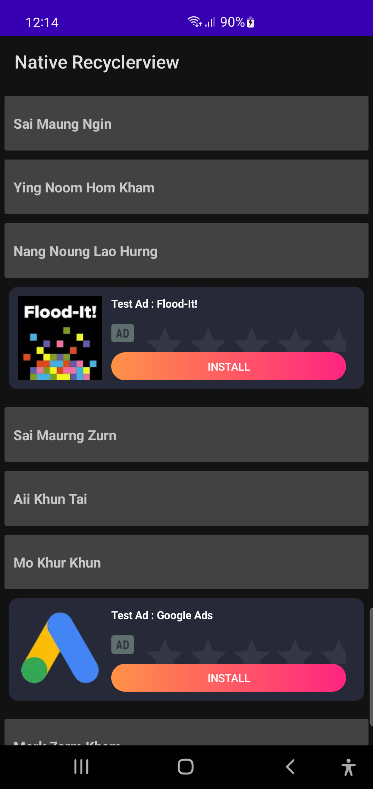
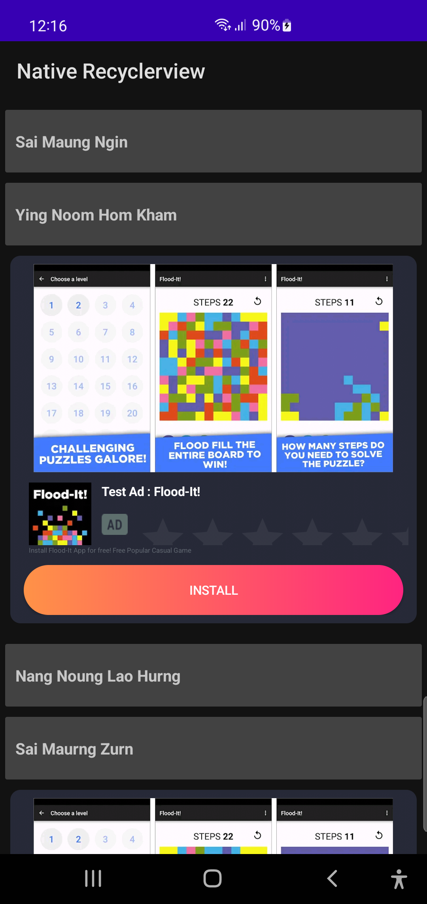
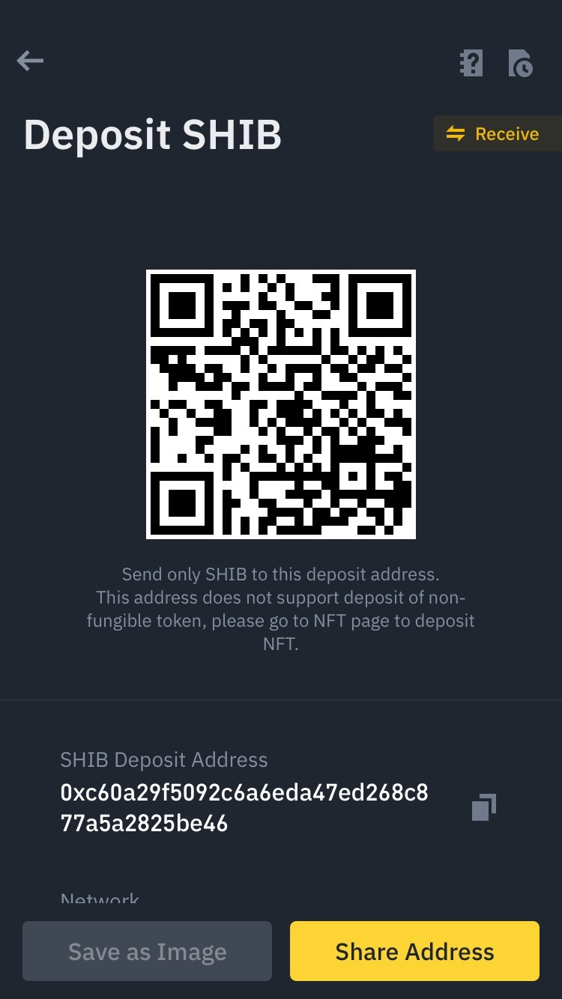
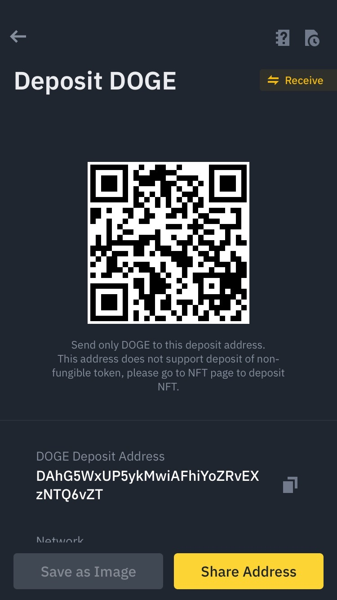

## NativeAds RecyclerView Library
>Android library for add Naive Ads into RecyclerView list items.

## Update
- updated to the latest version of Admob SDK
- support on Android SDK 30, 31, 32 ,33

## For developer
To make your app can earn more revengue ` by Showing Native Ads into RecyclerView list items `. Please check more details from below.

## How to use NaiveAds RecyclerView Library
Step 1. Add the JitPack repository to your build file 
  ```
  allprojects {
		repositories {
			...
			maven { url 'https://jitpack.io' }
		}
	}
  ```
  If you are using Android Studio Bumble bee or latest version, add JitPack repository to `settings.gradle` file.
  ```
  dependencyResolutionManagement {
    repositoriesMode.set(RepositoriesMode.FAIL_ON_PROJECT_REPOS)
    repositories {
        google()
        mavenCentral()
        maven { url 'https://jitpack.io' } // add this line
    }
}
```
  
  
Step 2. Add the dependency
  

	dependencies {
	        implementation 'com.github.saitawngpha:NativeAds-RecyclerView:1.0.1'
	}


Step 3. Add below code to setup your Adapter by Kotlin.
  

        recyclerView.layoutManager = LinearLayoutManager(this@MainActivity)
            val admobNativeAdAdapter: AdmobNativeAdAdapter = AdmobNativeAdAdapter.Builder
                .with(
                    "ca-app-pub-3940256099942544/2247696110",  //Create a native ad id from admob console
                    myAdapter,  //The adapter you would normally set to your recyClerView
                    "medium" //Set it with "small","medium" or "custom"
                )
                .adItemIterval(2) //native ad repeating interval in the recyclerview
                .build()
            recyclerView.adapter = admobNativeAdAdapter
           
 Add below code to setup your Adapter by Java.
  

      AdmobNativeAdAdapter admobNativeAdAdapter=AdmobNativeAdAdapter.Builder
	      .with(
		      "",//Create a native ad id from admob console
		      myAdapter,//The adapter you would normally set to your recyClerView
		      "medium"//Set it with "small","medium" or "custom"
		      )
	    .adItemIterval(interval)//native ad repeating interval in the recyclerview
	    .build();
    recyclerView.setAdapter(admobNativeAdAdapter);//set your RecyclerView adapter with the admobNativeAdAdapter

## Demo
Native ads Small Layout |  Native ads Medium Layout
:-------------------------:|:-------------------------:
  |   

## Reference Project


## By me coffee
 Shiba |  BTC | ETH | DOGE |
:-------------------------:|:-------------------------:|:-------------------------:|:-------------------------:|
  |   |  | |
